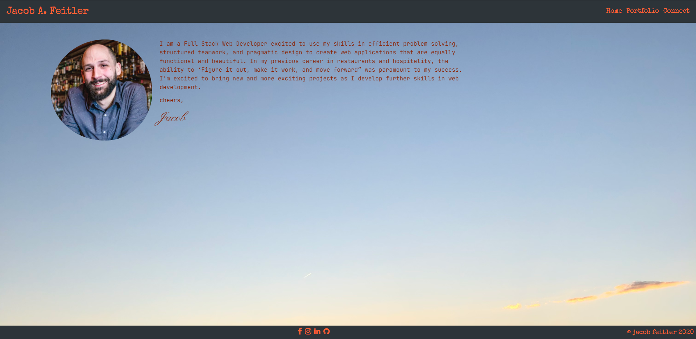
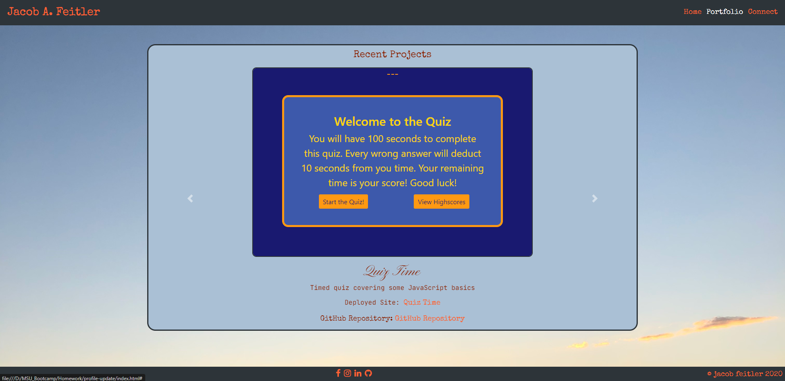
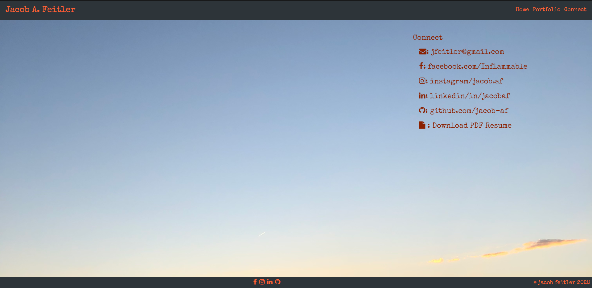
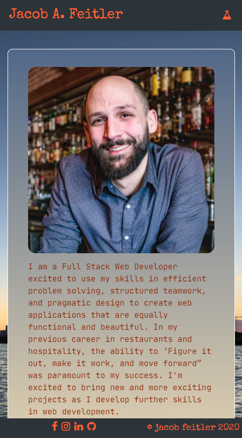
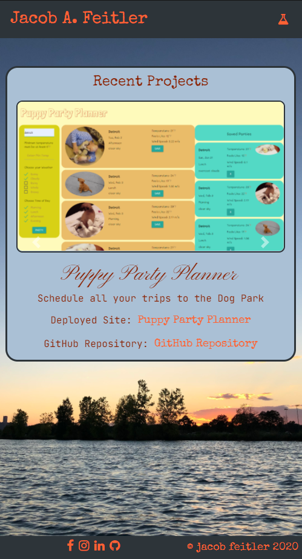
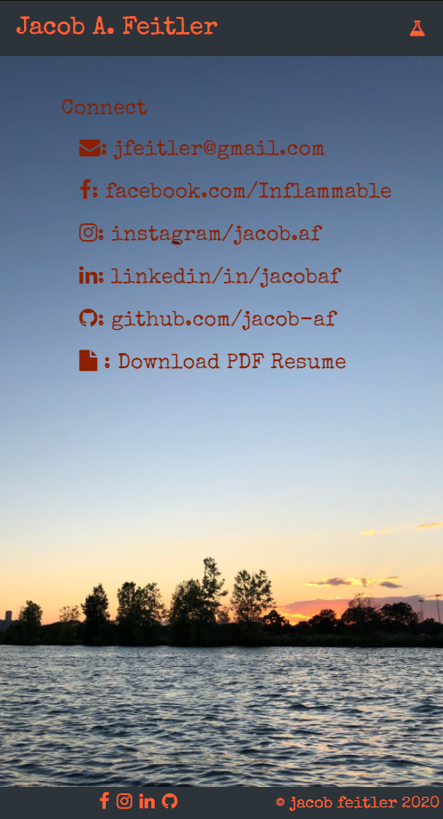

# profile-update

## About this page

My professional webpage updated to a single page site using [bootstrap](), [jquery](), [animate.css](), and [google-fonts]().

Site is deployed at: [www.jacobaf.com](http://www.jacobaf.com/)

## Features

- Fully responsive design for any screen size.
- Links to socia media.
- Link to one page resume in PDF format
- Inclusion of animations for smooth changes between displayed fields.

## Potential Improvements

- a working contact form instead of links

## Files

- index.html
- README.md
- LICENSE
- (assets)
  - script.js
  - style.css
  - JacobFeitlersResume012021.pdf
  - (images)
    - headshot-from-cocktail-shot.png
    - main-image,jpg
    - puppy-party.png
    - quiz-time.png
    - weather-travel.png
    - work-da-scheduler.png
    - (Screenshots)

#### Screenshots

## Credits

A thank you forever for reference material at [MDN](https://developer.mozilla.org/en-US/), [w3 Schools](http://w3schools.com), and [Stack Overflow](https://stackoverflow.com/).

## License

This website is licensed under the MIT license, copyright 2021
